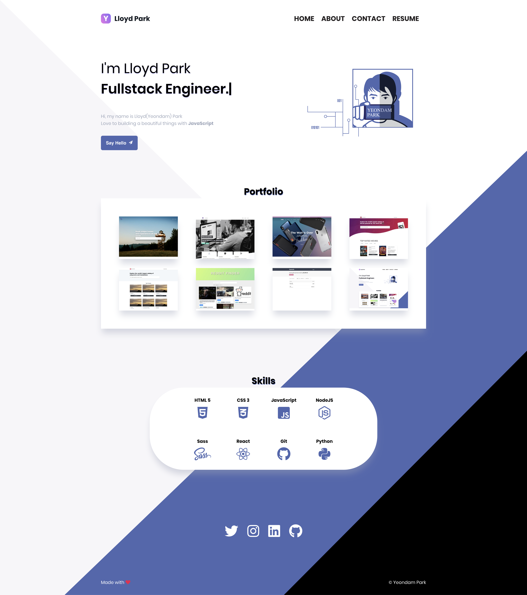

# Personal portfolio website 😎
![MIT License][license-badge]



## Built with React/React Router/Sass
<p>
  
  
</p>

Made with React and custom styles from scratch to show off some of my works.

## Things I've learned
* Animation with React
* How to write more easy to maintain and modular Sass
* How to use third party react-libraries

### Run locally
```js
git clone https://github.com/yeondam88/yeondam-portfolio-react.git

npm install

npm start
```

## TODO
* [ ] 🚀Migrate to GatsbyJS or Next.js
* [ ] 💻Build backend API for blog post & portfolio
* [ ] Django ? or Node.js powered backend ?
* [x] 🔥Improving performance
* [ ] Creating admin panel
* [ ] Revamping the design and add to study resource page with data
[license-badge]: https://img.shields.io/npm/l/console.pretty.svg?style=flat-square
